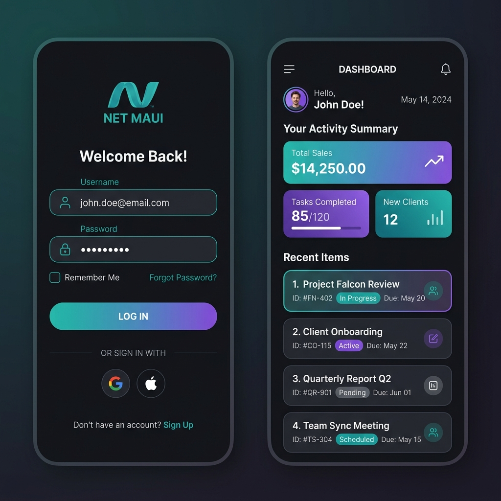

# .NET MAUI SQLite Authentication & Dashboard Application

A cross-platform mobile and desktop application built with C# and **.NET MAUI** (Multi-platform App UI) that implements a complete local user authentication flow (Sign Up, Login, Password Management) backed by an **SQLite database**, styled with a premium modern dark mode theme.

---

## 🎨 User Interface Mockup
Below is a high-fidelity visual mockup of the dark-mode login and main landing dashboard interfaces:



---

## 📋 Table of Contents
1. [Features](#-features)
2. [Architecture & Technology Stack](#-architecture--technology-stack)
3. [Repository Structure](#-repository-structure)
4. [Database Schema](#-database-schema)
5. [Prerequisites](#-prerequisites)
6. [Compilation & Usage](#-compilation--usage)

---

## 🎯 Features
*   **Secure Authentication**: Complete login and registration flows with input validation.
*   **SQLite Local Storage**: Thread-safe asynchronous database access to store user credentials and profile details.
*   **Cross-Platform**: Compile for Android, iOS, Windows, and macOS from a single codebase.
*   **Adaptive Dark Styling**: Shared XML styling resources defining a midnight-teal accent theme.
*   **Settings Management**: Interactive forms to update profile properties and passwords.

---

## 🛠 Architecture & Technology Stack
*   **Framework**: .NET MAUI (supporting .NET 8.0)
*   **Language**: C# 12 / XAML (Extensible Application Markup Language)
*   **Database**: SQLite-net-pcl (Asynchronous ORM)
*   **Design Pattern**: MVVM-ready architecture separating visual declarations (XAML files) from lifecycle controllers (C# Code-behinds).

---

## 📂 Repository Structure
```text
MauiApp1/
├── MauiApp1.sln              # Visual Studio Solution file
├── MauiApp1/
│   ├── Platforms/            # Target specific OS hooks (Android, iOS, Windows, Mac)
│   ├── Resources/            # Visual assets (Fonts, Images, App Icon, Splash screen)
│   ├── App.xaml              # Global application setup and lifecycle hooks
│   ├── Colors.xaml           # Central dictionary for styling color palettes
│   ├── DatabaseHelper.cs     # SQLite CRUD operations and DB initialization
│   ├── User.cs               # User entity data model mapped to database columns
│   ├── LoginPage.xaml        # Login screen XAML structure
│   ├── SignUpPage.xaml       # Registration screen XAML structure
│   ├── HomePage.xaml         # Authenticated main dashboard
│   ├── SettingsPage.xaml     # Profile updates and credentials configuration
│   ├── Page2.xaml            # Secondary navigation demo panel
│   └── MauiProgram.cs        # Dependency injection and startup builder
└── screenshots/
    └── maui_app_mockup.png   # Mockup image for repository preview
```

---

## 📊 Database Schema

The application creates and manages an SQLite table mapped to the `User` class:

| Column Name | Data Type | Key Constraints | Description |
|---|---|---|---|
| **ID** | `INTEGER` | Primary Key, Auto-Increment | Unique identifier for each account |
| **Username** | `TEXT` | Unique, Not Null | Account identifier |
| **Password** | `TEXT` | Not Null | Account credentials |
| **Email** | `TEXT` | Not Null | User contact email |
| **FullName** | `TEXT` | Not Null | User profile display name |
| **Phone** | `TEXT` | Optional | User telephone contact |

---

## 🚀 Prerequisites
To build and run this project, make sure you have the following installed:
1. **.NET 8.0 SDK** or later.
2. **MAUI Workloads**: Install via CLI:
   ```bash
   dotnet workload install maui
   ```
3. **Visual Studio 2022** (with the *.NET Multi-platform App UI development* workload checked).

---

## 💻 Compilation & Usage

### 1. Build via dotnet CLI
You can restore, compile, and run the app for your target platform using the command-line interface:

```bash
# Navigate to the inner app directory containing MauiApp1.csproj
cd MauiApp1/MauiApp1

# Run for Windows (from Command Prompt or PowerShell)
dotnet run -f net8.0-windows10.0.19041.0

# Run for Android Emulator (requires Android SDK installed and emulator running)
dotnet run -f net8.0-android
```

### 2. Run in Visual Studio
1. Open the solution file `MauiApp1.sln` in **Visual Studio 2022**.
2. Select `MauiApp1` as the startup project.
3. In the debug target dropdown, choose your target platform (e.g. `Framework -> net8.0-windows` or `Android Emulators`).
4. Press **F5** to build and run.
